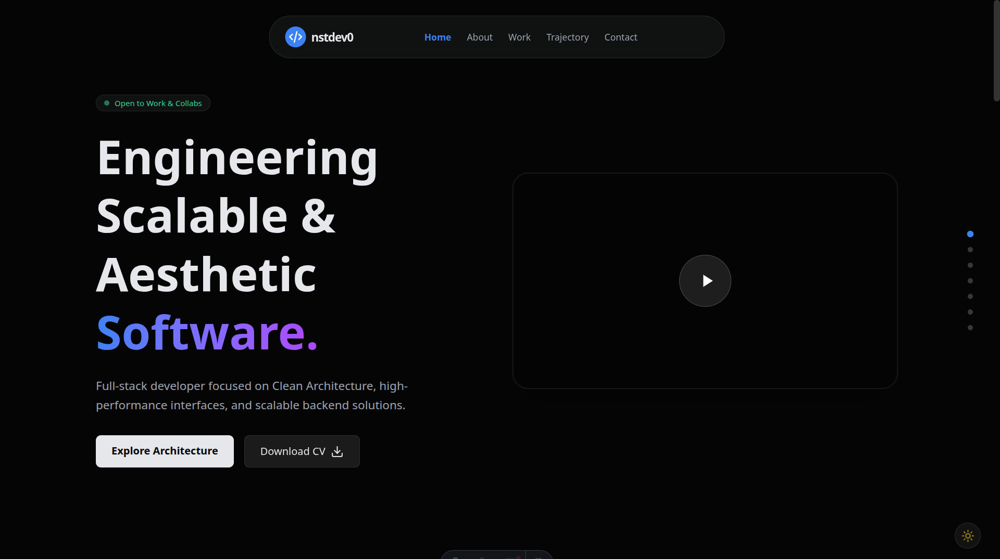

# Portfolio

Un sitio web de portafolio personal moderno y responsivo construido con [Astro](https://astro.build), [React](https://react.dev) y [Tailwind CSS v4](https://tailwindcss.com).



## 🚀 Características

-   **Alto Rendimiento:** Construido con la arquitectura de islas de Astro para una carga rápida.
-   **Diseño Responsivo:** Totalmente adaptado a dispositivos móviles, tabletas y escritorio.
-   **Animaciones Suaves:** Integración con [Framer Motion](https://www.framer.com/motion/) para transiciones elegantes.
-   **Estilizado Moderno:** Utiliza la última versión de Tailwind CSS (v4) para un diseño limpio y mantenible.
-   **Componentes Reutilizables:** Estructura modular con componentes de React.
-   **Iconos:** Integración con [Lucide React](https://lucide.dev) para iconos consistentes.

## 🛠️ Tech Stack

-   **Framework Principal:** [Astro](https://astro.build)
-   **Librería UI:** [React](https://reactjs.org/)
-   **Estilos:** [Tailwind CSS v4](https://tailwindcss.com/)
-   **Animaciones:** [Framer Motion](https://www.framer.com/motion/)
-   **Iconos:** [Lucide React](https://lucide.dev/)
-   **Fuentes:** [Fontsource (Inter)](https://fontsource.org/fonts/inter)

## 📂 Estructura del Proyecto

El proyecto sigue una estructura estándar de Astro:

```bash
/
├── public/           # Activos estáticos (imágenes, fuentes, etc.)
├── src/
│   ├── components/   # Componentes reutilizables (Hero, About, Projects, etc.)
│   ├── layouts/      # Plantillas de diseño (Layout.astro)
│   ├── pages/        # Rutas y páginas (index.astro)
│   └── styles/       # Estilos globales (si aplica)
├── astro.config.mjs  # Configuración de Astro
├── package.json      # Dependencias y scripts
└── ...
```

## 🧞 Comandos

Todos los comandos se ejecutan desde la raíz del proyecto, desde una terminal:

| Comando                   | Acción                                           |
| :------------------------ | :----------------------------------------------- |
| `pnpm install`            | Instala las dependencias                         |
| `pnpm run dev`            | Inicia el servidor de desarrollo local en `localhost:4321` |
| `pnpm run build`          | Construye el sitio para producción               |
| `pnpm run preview`        | Vista previa de la construcción de producción    |

## ⚡️ Comenzando

1.  **Clonar el repositorio:**

    ```bash
    git clone https://github.com/tu-usuario/portfolio.git
    cd portfolio
    ```

2.  **Instalar dependencias:**

    ```bash
    pnpm install
    ```

3.  **Iniciar el servidor de desarrollo:**

    ```bash
    pnpm run dev
    ```

4.  Abrir `http://localhost:4321` en tu navegador.

## 📝 Personalización

Para personalizar el contenido, edita los componentes en `src/components/`. Por ejemplo:

-   `Hero.astro`: Cambia el título principal y la introducción.
-   `About.astro`: Actualiza tu descripción personal.
-   `Projects.astro`: Agrega o modifica tus proyectos destacados.
-   `Experience.astro`: Actualiza tu historial laboral.
-   `Contact.astro`: Configura tus enlaces de contacto.

## 📄 Licencia

Este proyecto está bajo la Licencia MIT. Consulta el archivo `LICENSE` para más detalles.
